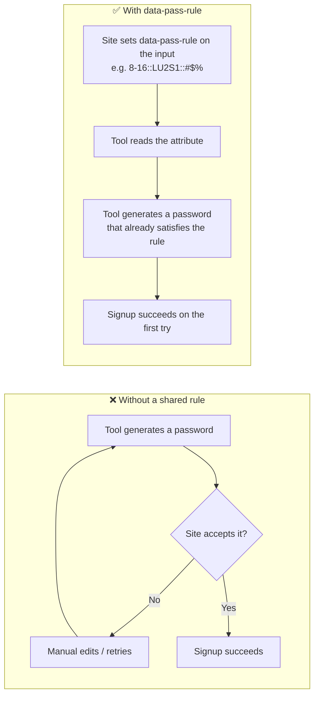

# open-pass-spec

Standard specification for password generation, storage and related aspects.

## Password Generation

Password Generation is a fundamental aspect of online security, helping to safeguard our digital identity, protect our
valuable information and sometimes organization compliances.

Password Generator Tools are used to generate strong, complex and unique passwords for every account. These tools are
built into browsers (like Firefox), browser extensions and Password Managers.

However, these tools have scope of improvements.

### Case 1 : Invalid password generation

Every website have different set of rules for a valid password. Since the tool isn't aware of the rule, sometimes it
takes multiple tries or manual changes to generate a valid password for the site. This can be a bit of inconvenience.

#### Proposed Solution :

> POC : [Demo Signup Page](https://rsb-23.github.io/open-pass-spec/pass-rule)

It can be solved by

- adding a `data-pass-rule` attribute directly on the password `<input>` in the signup page.
- tools can access it using the `input[data-pass-rule]` selector.
- Rule is stored in a standard format, making it easy to parse and implement.



[read in detail ...][passrule]

```html

<input type="password" data-pass-rule="8-16::LU2DS::#$%">
```

### Case 2 : Easy access to Account Settings

For better online security, users should change passwords regularly for all their accounts and delete unused accounts.
This keeps their digital presence secure in case on hacks and data breaches.

But, it is not as easy as it sounds due to inconsistent methods for password changes across services and complex
processes of navigating to account deletion pages.

#### Proposed Solution :

These can be simplified if services use `./well-known/` urls to redirect to respective pages. This will improve user
experience and also provide a programmatic way for password managers to quick links for the same.

- `.../well-known/change-password` [🌐][change_uri]
- `.../well-known/delete-account` [🌐][delete_uri]

---

> [!NOTE]
> Click 🌐 to read details.

[passrule]: ./pass-rule/PassRule.md
[change_uri]: https://w3c.github.io/webappsec-change-password-url
[delete_uri]: https://github.com/rsb-23/right-to-be-forgotten
