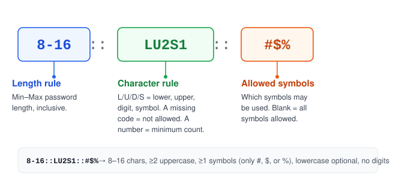

# Pass Rule Proposal

## Password Rules

**Notation:** `Min-Max::L#U#D#S#::Symbols`  
**Default value:** `8-16::L1U1D1S::`  
**All Symbols:** ```!`"#$%&'()*+,-./:;<=>?@[\]^_{|}~```



The rule consists of three parts — length rule, character rule, and allowed symbols — separated by `::`.
These are the mandatory requirements for a password generator.

| Part            | Description                                                                                           | Example |
|-----------------|-------------------------------------------------------------------------------------------------------|---------|
| Length rule     | Specifies the min and max length for a valid password.                                                | `8-16`  |
| Character rule  | Specifies the allowed character sets and the number (`#`) of mandatory characters from each set.      | `LU2S1` |
| Allowed symbols | Specifies which symbols are allowed in the password. All symbols are allowed when this part is blank. | `#$%`   |

So `8-16::LU2S1::#$%` denotes a password that:

- is between 8 and 16 characters long (inclusive)
- can contain lowercase, uppercase, and symbols, but not digits
- must have at least 2 uppercase and 1 symbol; it may or may not have lowercase characters
- may only use `#`, `$`, or `%` as symbols

### Character rule details

- Each code (`L`, `U`, `D`, `S`) may optionally be followed by a number giving the minimum required count from that set.
- A code with no number (e.g. `L` in `LU2S1`) means that set is allowed but has no minimum — zero or more characters
  from it are fine.
- A code that is **omitted entirely** means that character set is **not permitted** at all (e.g. the absence of `D` in
  `LU2S1` means digits are disallowed, not just optional).
- The sum of all minimum counts (`L#+U#+D#+S#`) must not exceed `Max`. A rule where it does is invalid.

## For Web Developers

Add the `data-pass-rule` attribute directly to the password `<input>` on the `signup` and `change-password` pages:

```html
<input type="password" id="new-password" data-pass-rule="8-16::LU2DS::#$%">
```

Notes:

- Attaching the rule to the input avoids ambiguity on pages with multiple password
  fields (e.g. current / new / confirm password on a change-password page), since the rule is unambiguously tied to the
  field it governs.
- Fields without a `data-pass-rule` attribute should fall back to the default value.
- A "confirm password" field typically doesn't need its own rule — it only needs to be checked for a match against the
  primary password field.
- If you want to surface the rule as a visible hint, generate the hint element via script from the input's
  `data-pass-rule` value and link it with `aria-describedby` for accessibility.

## For Tools Developers

1. Access the rule using the `input[data-pass-rule]` selector (optionally scoped to `input[type="password"]`). Use the
   default value if the attribute isn't present.
2. Parse the rule value and use it as parameters to the password generation function.